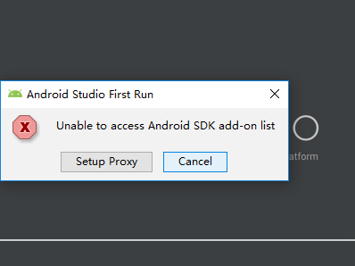
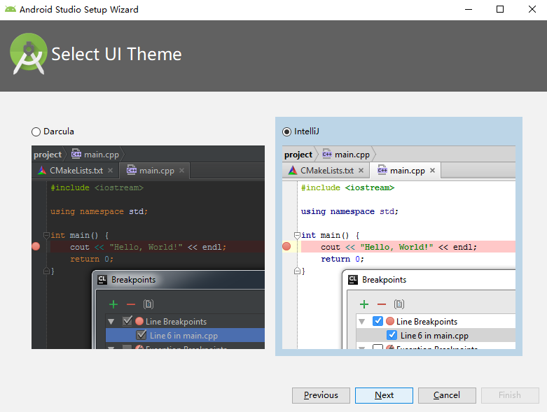
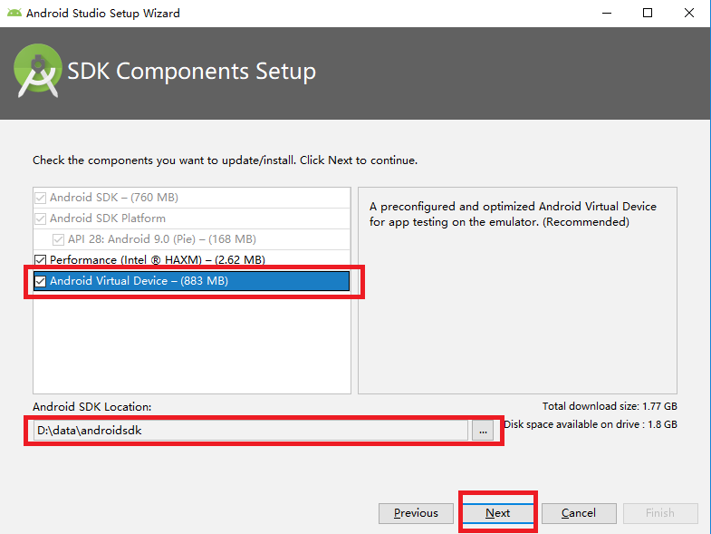
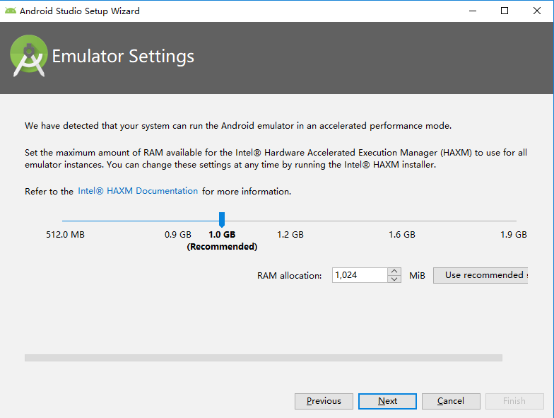
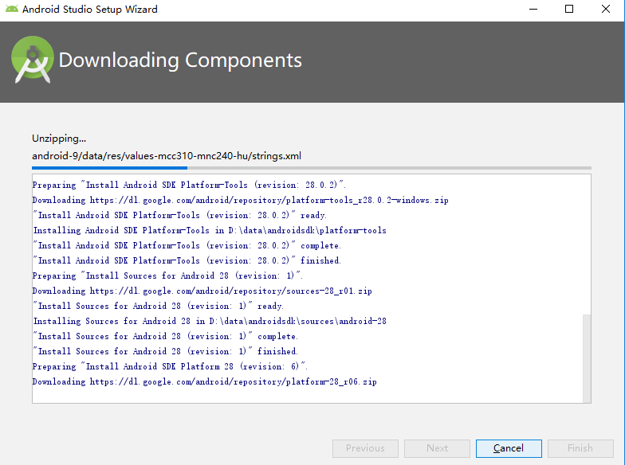
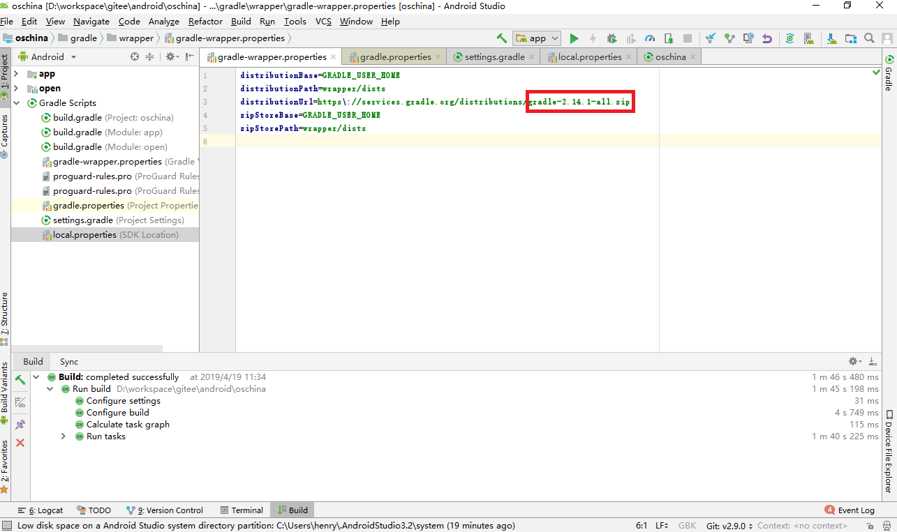
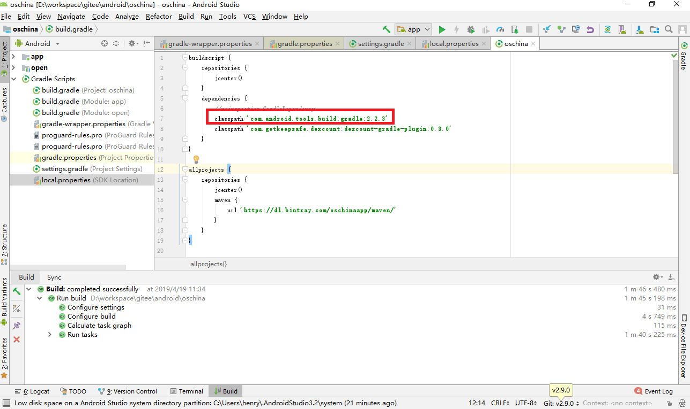

# Android Studio简介

# 安装工具

* JDK - Android 开发是在 Java 的基础上进行的。
* Android Studio - 编辑器。
* Android SDK - Android 软件开发工具包。
* Android Virtual Device - 设备模拟器，用于模拟真机运行 APP。

# 安装JDK

# 安装Adroid Studio

## 下载

前往[Android Stuidio 中文社区-安卓工具集](http://www.android-studio.org/)页面下载Windows
(64-bit)版本。

## 安装

* 下载[android-studio-ide-181.5014246-windows.zip](https://dl.google.com/dl/android/studio/ide-zips/3.2.0.26/android-studio-ide-181.5014246-windows.zip)并解压到安装目录下。

# 安装Android SDK

# 安装Android Virtual Device

# 启动

## 步骤

* 点击bin/studio64.exe运行Android Studio。

* 启动时提示：不能访问 Android SDK 插件列表，是否设置代理，点“取消”进入 Android Studio 安装向导界面。

* 选择“自定义”设置。

* 同安装IDEA一样，选择默认地intellij风格。

* 安装的是 -ide-版的，即安装包没有包含“Android SDK”时，这里同样可以先设置一个目录，后续会提示联网下载安装，但是对于网络不好的，不推荐这么做(推荐要么就是直接安装“bundle”版，要么就先单独安装 SDk)。

* 勾选“Android Virtual Device”

* 点击“下一步”

* 验证设置，点击“完成”。

## 配置Android Studio开发环境

### 开发环境要求

* Android Studio >= 2.2
* Gradel Version: 2.14.1
* Gradle Plugin Version: 2.2.3
* SDK Tool >= 24.0.3

### 配置Gradle

* 配置Gradle Version为 2.14.1

* 配置Gradle Plugin Version为 2.2.3

## 启动Build

* 点击 Build 按钮运行即可。

## 解决 dl.google.com无法访问

上[站长工具 > Ping检测](http://ping.chinaz.com)，搜索“dl.google.com”和“dl-ssl.google.com”地ip地址。分别设置好本地hosts即可。

# 参考

* [Android Stuidio 中文社区-安卓工具集](http://www.android-studio.org/)

* [Gradle下载地址](https://services.gradle.org/distributions/)